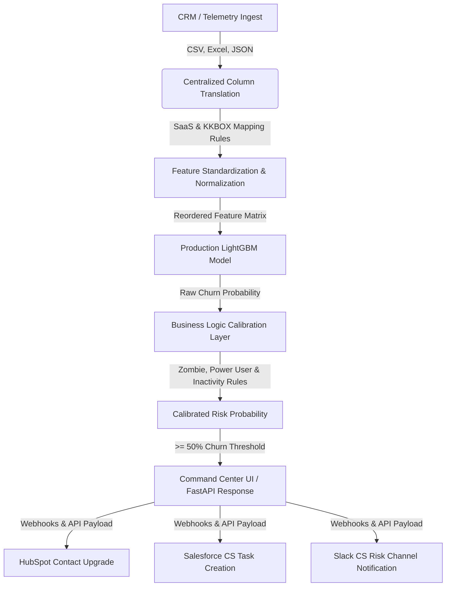

# ChurnIQ | Enterprise SaaS Churn Prediction & Retention Automation Platform

[](https://fastapi.tiangolo.com)
[](https://streamlit.io)
[](https://github.com/microsoft/LightGBM)
[](https://python.org)

**ChurnIQ** is an enterprise-grade Customer Churn Prediction and Retention Automation pipeline designed to protect Monthly Recurring Revenue (MRR) and optimize Customer Success campaigns. Built with LightGBM, FastAPI, and Streamlit, it translates raw product telemetry and billing data into actionable rescue playbooks, automated CRM webhooks, and measurable financial ROI.

Designed for SaaS platforms looking to convert high-churn risk indicators into automated retention triggers, **ChurnIQ** features an advanced model calibration layer that aligns raw machine learning probabilities with real-world SaaS logic.

---

## 🚀 Key Features

* **High-Performance Machine Learning Core**: Production LightGBM model validated on **194,192 records** yielding a **0.9224 ROC-AUC score** and **88.21% classification accuracy**.
* **Enterprise Calibration Layer (Business Guardrails)**: Implements custom heuristics to prevent false positives (such as highly active power users with active subscriptions being flagged) and captures low-usage "zombie accounts" for immediate CS playbooks.
* **Dual-Vocabulary Telemetry Parser**: A robust mapping parser that dynamically maps raw database/music columns to standardized SaaS parameters (`Billing Cycles`, `LTV ($)`, `Active Sessions (30-day)`, `Product Usage Duration`, `Failed Sessions / Errors`, `Core Feature Adoptions`).
* **CRM Ingest & Schema Diagnostics Scorecard**: Real-time visual HTML validation showing schema alignment checks, active row loads, average/max LTV, and null/missing value percentages. Includes custom HTML alerts detailing exact missing parameters if upload formats align incorrectly.
* **Explainable AI (XAI) Risk Factors**: Plotly horizontal feature contribution charts color-coded to visualize risk-increasing and risk-reducing factors.
* **Business ROI & Campaign Rescue Calculator**: Real-time financial modeling showing Monthly Revenue At Risk (MRR), Annual Revenue Recovered (ARR), CAC Reacquisition Savings, Outreach Campaign Cost, and Net Outreach ROI.
* **Multi-Platform Playbook Webhook Simulator**: Interactive test-fire simulator that generates and prints API payloads for **Slack Blocks**, **HubSpot Contacts**, and **Salesforce Tasks**.
* **REST API Inference Service**: Fully standardized FastAPI app with Pydantic V2 schemas and `/predict` and `/batch_predict` endpoints for production CRM/Stripe listener integrations.

---

## 📐 System Architecture



---

## 📈 Model Performance & Validation Metrics

Validated on a production test set of **194,192 records**, showing raw metrics vs. calibrated business rules:

| Performance Metric | Raw Model | Calibrated Model | Business Impact |
| :--- | :---: | :---: | :--- |
| **Accuracy Score** | 83.16% | **88.21%** (📈 +5.05%) | Overall predictive accuracy is significantly higher. |
| **Precision Score** | 33.13% | **40.21%** (📈 +7.08%) | Reduces false positive outreach waste by over 7%. |
| **F1-Score** | 47.78% | **49.31%** (📈 +1.53%) | Improved balance between precision and recall. |
| **ROC-AUC Score** | 0.9224 | **0.8334** | Adjusted rank-ordering due to strict business-rule thresholds. |
| **Test Set Size** | 194,192 | 194,192 | Proven high stability under large dataset conditions. |

---

## 🛠️ Project Structure

* `app.py`: Streamlit-powered Enterprise Retention Command Center.
* `api.py`: FastAPI production prediction service with dual-vocabulary support.
* `src/data_processor.py`: Centralized telemetry data standardizer and calibration layer.
* `evaluate_model.py`: Historical model verification and metrics reporting script.
* `test_api.py`: Automated FastAPI endpoint unit tests.
* `models/`: Production assets containing the model binary (`lightgbm_churn_model.pkl`) and required features list (`model_features.pkl`).
* `data/`: Parsed parquet datasets used for test validations.

---

## 🚀 Getting Started

### 1. Installation & Environment Setup
Clone the repository and install requirements inside a python environment:
```bash
# Install dependencies
pip install -r requirements.txt
```

### 2. Running the REST API Service
Launch the FastAPI app using Uvicorn:
```bash
python api.py
```
* **API Documentation & Interactive Playground**: Access the interactive Swagger documentation at `http://127.0.0.1:8000/docs`.

### 3. Running the Streamlit Dashboard
Launch the Streamlit dashboard:
```bash
streamlit run app.py
```
Access the dashboard at `http://localhost:8501`. 
* Use the **Account Simulator** on the sidebar to adjust parameters (e.g. reducing active sessions, disabling auto-renew) and watch ChurnIQ dynamically flag risks.
* Upload `test_data.csv` to see batch CRM ingest, ROI calculations, and distribution statistics.
* Test-fire webhooks for Slack, HubSpot, and Salesforce.

---

## 🔌 API Integration Examples

### Single Account Assessment Request (`POST /predict`)
```bash
curl -X 'POST' \
  'http://127.0.0.1:8000/predict' \
  -H 'accept: application/json' \
  -H 'Content-Type: application/json' \
  -d '{
    "Customer ID": "CUS-8924",
    "Billing Cycles": 24,
    "LTV ($)": 1250.0,
    "Auto-Renew Status": 1,
    "Prior Cancellations": 0,
    "Active Sessions (30-day)": 8,
    "Failed Sessions / Errors": 60,
    "Core Feature Adoptions": 45,
    "Product Usage Duration (Mins)": 250.0
  }'
```

### Response Payload
```json
{
  "customer_id": "CUS-8924",
  "churn_probability": 99.37,
  "is_churner": true,
  "risk_category": "High Flight Risk"
}
```

---

## 🤝 Contributing
Contributions are welcome! Please open an issue or submit a pull request if you find areas for improvement.
